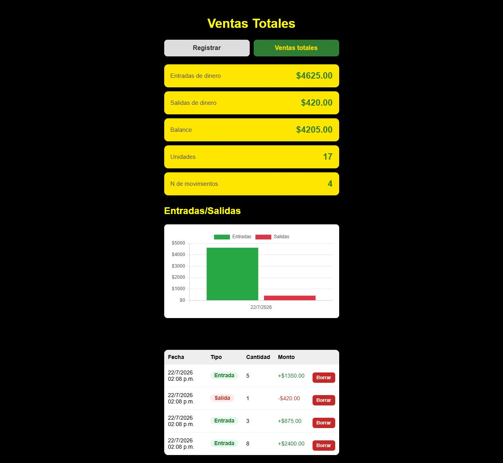

# Control de ventas web

[](https://github.com/ricardovelardecruz/VENTAS-WEB/actions/workflows/ci.yml)


Aplicación web adaptable a celular y computadora para registrar entradas y salidas de dinero, consultar movimientos y visualizar el balance de un negocio.



## Funcionalidades

- Registro de ingresos y gastos con cantidad y monto.
- Resumen de entradas, salidas, balance y número de movimientos.
- Historial ordenado con opción para eliminar registros incorrectos.
- Gráfica diaria para comparar entradas y salidas.
- Persistencia local con SQLite y conexión opcional a Turso para producción.
- Interfaz adaptable a dispositivos móviles.

## Tecnologías

- Node.js y Express para el servidor y la API REST.
- JavaScript, HTML y CSS sin frameworks en el frontend.
- SQLite/libSQL para almacenar los movimientos.
- Chart.js para la visualización de datos.
- GitHub Actions para comprobar sintaxis y ejecutar pruebas automáticamente.

## Ejecutar el proyecto

Necesitas Node.js 20 o una versión posterior.

```bash
git clone https://github.com/ricardovelardecruz/VENTAS-WEB.git
cd VENTAS-WEB
npm install
copy .env.example .env
npm start
```

Abre `http://localhost:3000`. Si las variables de Turso están vacías, la aplicación crea automáticamente `ventas.db` para desarrollo local.

### Variables de entorno

| Variable | Requerida | Descripción |
| --- | --- | --- |
| `PORT` | No | Puerto del servidor; utiliza `3000` por defecto. |
| `TURSO_DATABASE_URL` | Solo en producción | URL de la base de datos libSQL/Turso. |
| `TURSO_AUTH_TOKEN` | Solo en producción | Token de acceso a Turso. |

Nunca publiques el archivo `.env` ni tokens reales. Utiliza `.env.example` únicamente como referencia.

## API

| Método | Ruta | Descripción |
| --- | --- | --- |
| `GET` | `/api/health` | Comprueba que el servidor está disponible. |
| `GET` | `/api/ventas` | Obtiene el historial de movimientos. |
| `POST` | `/api/ventas` | Registra una entrada o salida. |
| `DELETE` | `/api/ventas/:id` | Elimina un movimiento. |
| `GET` | `/api/totales` | Calcula entradas, salidas y balance. |

## Estructura

```text
VENTAS-WEB/
├── public/                 # Interfaz web y gráfica
├── test/                   # Pruebas automatizadas
├── .github/workflows/      # Integración continua
├── .env.example            # Configuración de referencia
├── server.js               # Servidor Express y API
└── package.json
```

## Comandos

```bash
npm start       # Inicia la aplicación
npm test        # Ejecuta las pruebas
npm run check   # Comprueba la sintaxis JavaScript
```

## Próximas mejoras

- Autenticación y separación de datos por usuario.
- Filtros por rango de fechas.
- Exportación de reportes a CSV o PDF.
- Edición de movimientos existentes.

## Licencia

Distribuido bajo la [licencia MIT](LICENSE).
